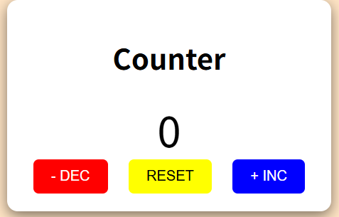

# 📈 Counter App

A simple counter application.  
You can increase, decrease, or reset the count using buttons.

---

## 🌐 Demo

[**Open the App**](https://muro-haya.github.io/web_dev/counter_app/)

---

## ✨ Features

- Increment the counter by 1
- Decrement the counter by 1
- Reset the counter to 0
- Display the current count on screen

---

## 🛠️ Built With

- HTML
- CSS
- JavaScript (Vanilla)

---

## 📂 Project Structure 
counter_app/  
├── index.html  
├── style.css  
└── script.js  

---
## 🙌 Author
[@muro-haya](https://github.com/muro-haya)