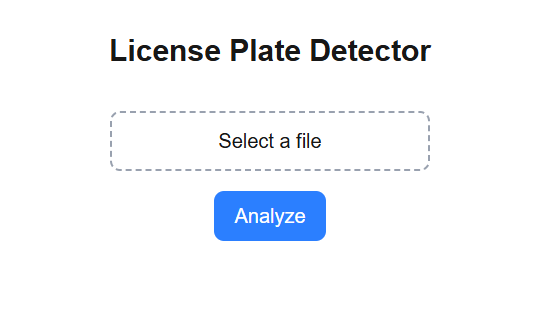
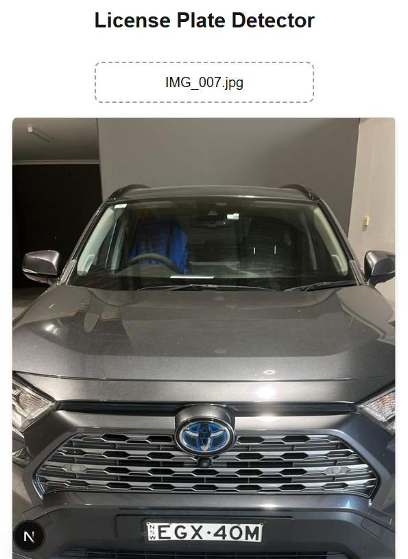
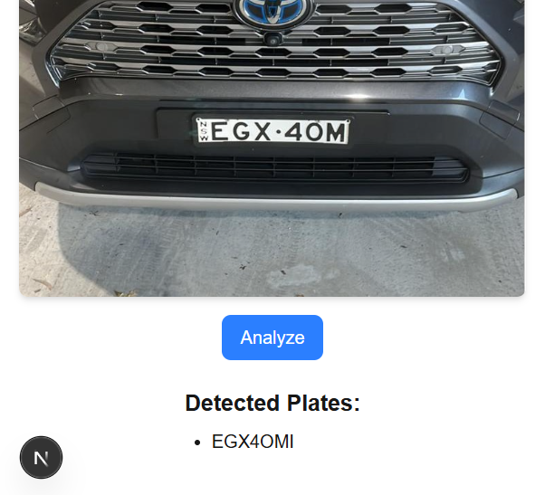

# 📈 License Plate Detection App

Select a picture of a car, and this app will automatically detect and read its license plate number (REGO).

---

## ✨ Features

- Click the "Select a file" button and choose a car image.

- Click the "Analyze" button to detect and display the REGO number.

---

## 🛠️ Built With

- JavaScript -front end (React, Tailwind CSS)
- Python     -back_end  (FastAPI, OpenCV, Yolo, Tesseract OCR)

---

## 🙌 Author
[@muro-haya](https://github.com/muro-haya)
