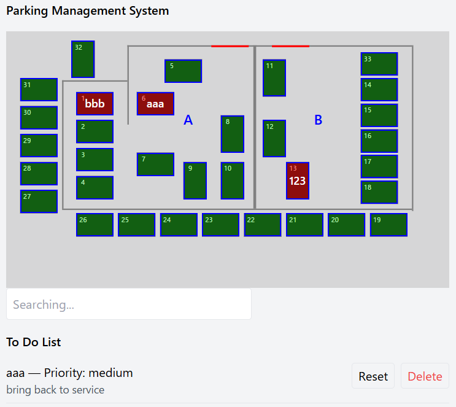
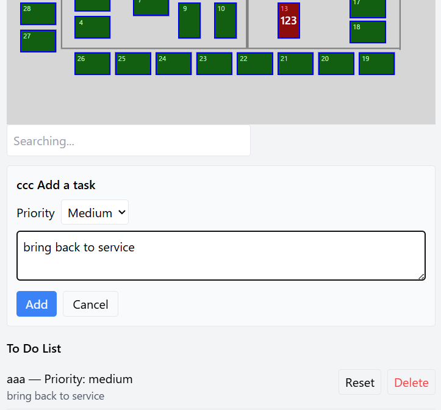

# 📈 Parking Management System

Manage parking slots status and vehicle allocation.  
And give the command to move a car.

---

## ✨ Features

- Vehicle registration - Select a slot and enter REGO.

- Commands to move cars.

---

## 🛠️ Built With

- JavaScript -front end (React, Tailwind CSS)
- Python     -back_end (FastAPI, WebSocket, SQLite)

---
## 🙌 Author
[@muro-haya](https://github.com/muro-haya)