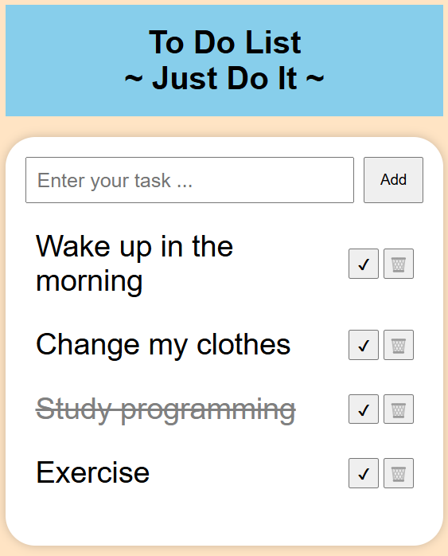

# 📈 To-Do List App

A simple To-Do List application.  
You can add, delete, and check things to do.

---

## 🌐 Demo

[**Open the App**](https://muro-haya.github.io/web_dev/toDoList_app/)

---

## ✨ Features

- Add new tasks easily
- Mark tasks as completed or uncompleted
- Delete tasks
- Persistent storage using Local Storage (your tasks stay saved even after refreshing the page)
- Simple and clean user interface

---

## 🛠️ Built With

- HTML
- CSS
- JavaScript (Vanilla)

---

## 📂 Project Structure 
counter_app/  
├── index.html  
├── style.css  
└── script.js  

---
## 🙌 Author
[@muro-haya](https://github.com/muro-haya)